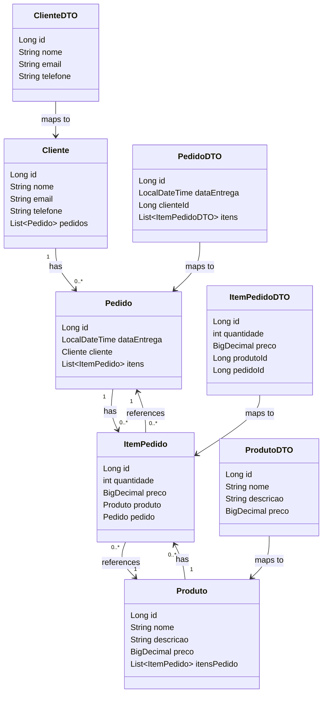

# OrderingSystem
Ordering system for Cute Cake's

## Diagrama de Classes

```mermaid
classDiagram
    class Cliente {
        Long id
        String nome
        String email
        String telefone
        List~Pedido~ pedidos
    }
    
    class Pedido {
        Long id
        LocalDateTime dataEntrega
        Cliente cliente
        List~ItemPedido~ itens
    }
    
    class Produto {
        Long id
        String nome
        String descricao
        BigDecimal preco
        List~ItemPedido~ itensPedido
    }
    
    class ItemPedido {
        Long id
        int quantidade
        BigDecimal preco
        Produto produto
        Pedido pedido
    }
    
    class ClienteDTO {
        Long id
        String nome
        String email
        String telefone
    }

    class PedidoDTO {
        Long id
        LocalDateTime dataEntrega
        Long clienteId
        List~ItemPedidoDTO~ itens
    }

    class ProdutoDTO {
        Long id
        String nome
        String descricao
        BigDecimal preco
    }

    class ItemPedidoDTO {
        Long id
        int quantidade
        BigDecimal preco
        Long produtoId
        Long pedidoId
    }

    Cliente "1" --> "0..*" Pedido : has
    Pedido "1" --> "0..*" ItemPedido : has
    Produto "1" --> "0..*" ItemPedido : has
    ItemPedido "0..*" --> "1" Produto : references
    ItemPedido "0..*" --> "1" Pedido : references

    ClienteDTO --> Cliente : maps to
    PedidoDTO --> Pedido : maps to
    ProdutoDTO --> Produto : maps to
    ItemPedidoDTO --> ItemPedido : maps to
```
